# Portfolify - React App

## Disclaimer

This project was created as a semester project for the course "Client applications in JavaScript" (KAJ). My goal was to develop an application for managing Watchlists and Portfolios in order to familiarize myself with new technologies. As the project was part of my semester assignment, there are some areas that could have been improved. However, due to time constraints and my limited experience with certain aspects, I had to prioritize completing the project.

## Project Description 

The project enables users to create watchlists and add stocks for tracking purposes. Additionally, it allows users to create various portfolios, add investments and purchases, and obtain information about the performance of their investments (profit/loss), among other features.

## Technical Overview

The project utilizes React, TypeScript, Redux, and Redux-Saga. It also incorporates SCSS and SCSS modules for styling. Additionally, the project has offline functionality through the use of a service worker. The Polygon API is employed to retrieve and update stock data. User state persistence is achieved using LocalStorage.

## UI Overview

[image1]: ./docs/1.png "Empty Watchlists"
[image2]: ./docs/2.png "Empty Portfolios"

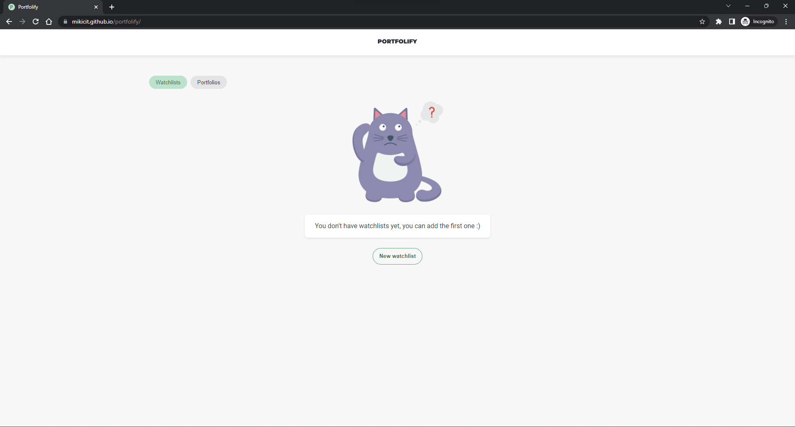
*Description: Empty Watchlists*

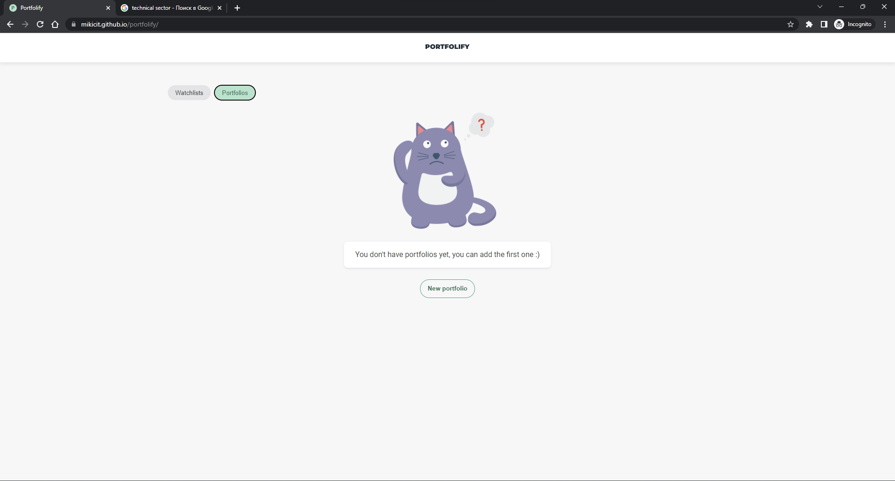
*Description: Empty Portfolios*

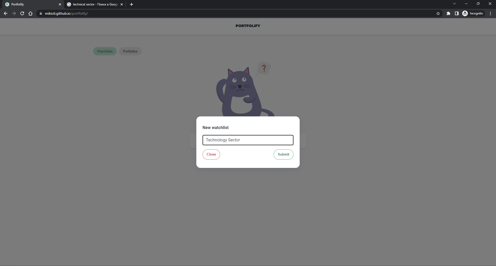
*Description: Create new Watchlist*

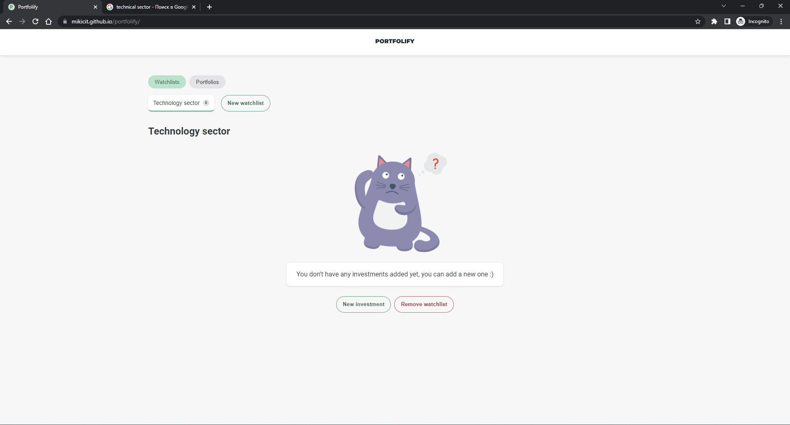
*Description: Emtpy Watchlist*

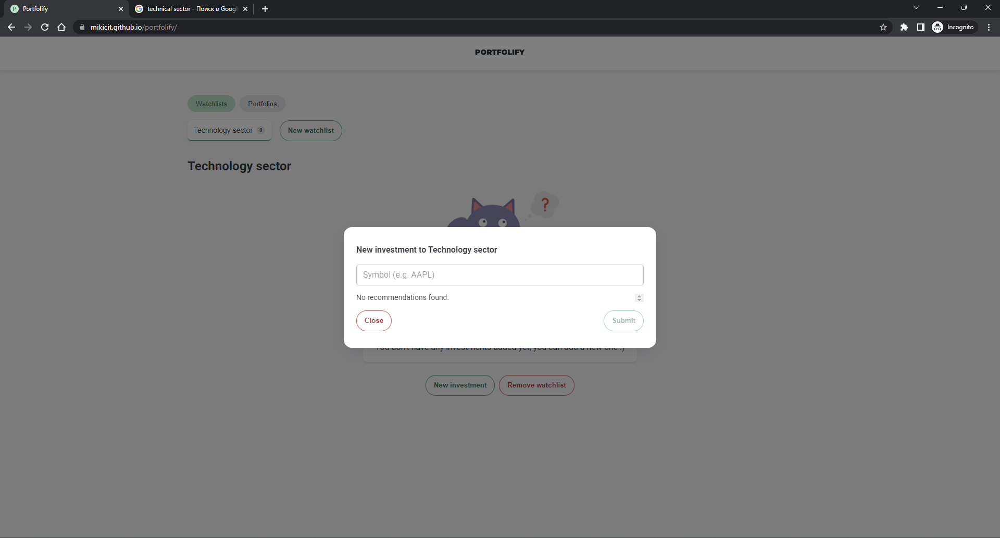
*Description: Find new Investment to Watchlist*

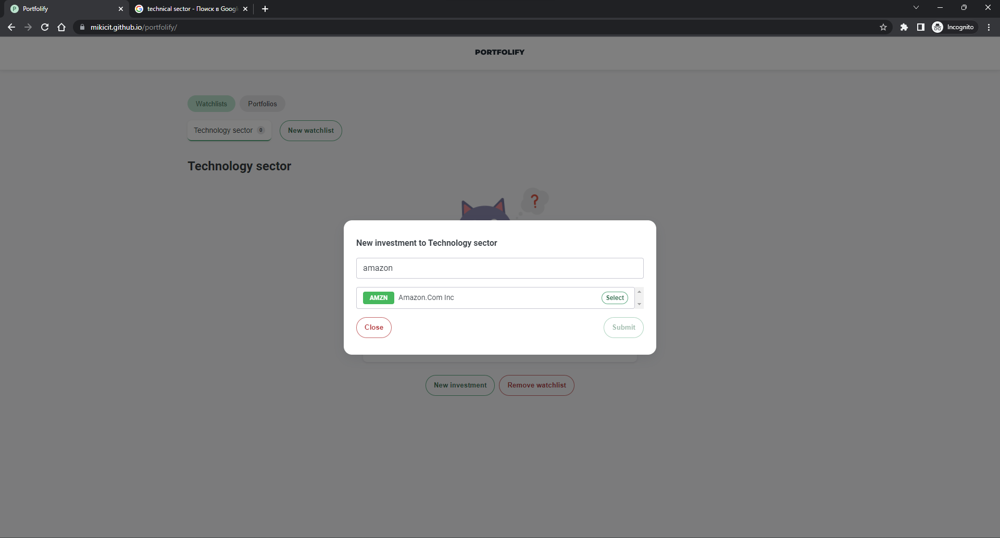
*Description: Selecting a found stock*

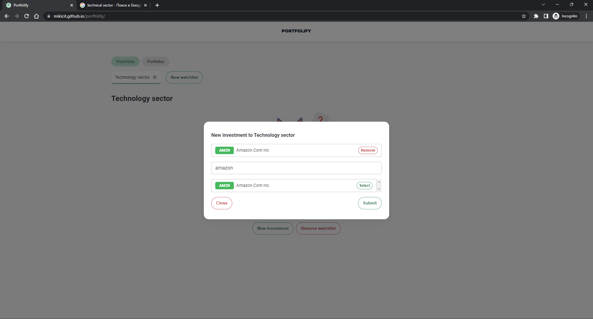
*Description: Selected a found stock*

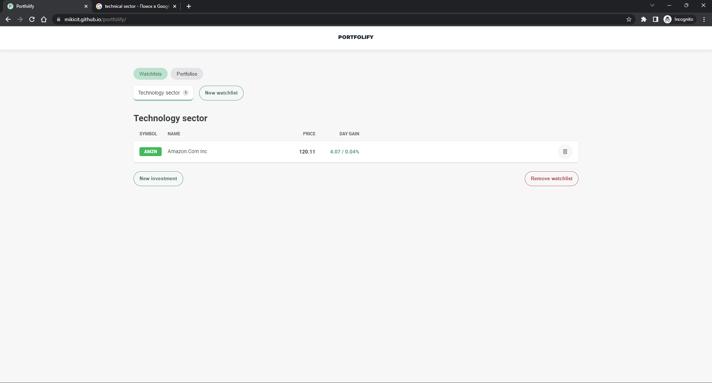
*Description: Added stock to Watchlist*

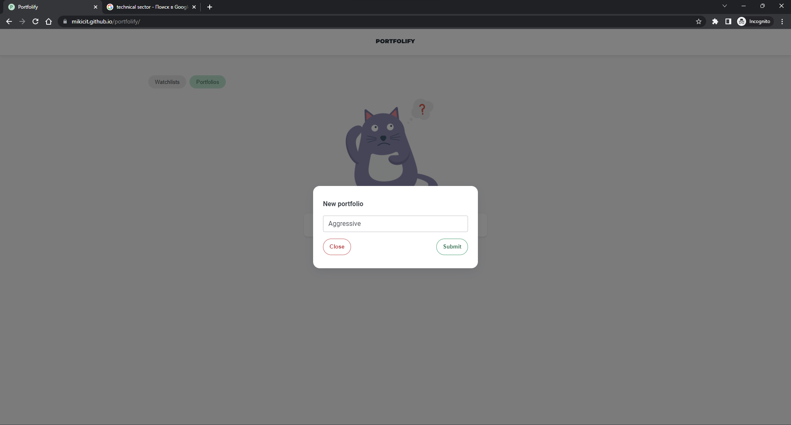
*Description: Create new Portfolio*

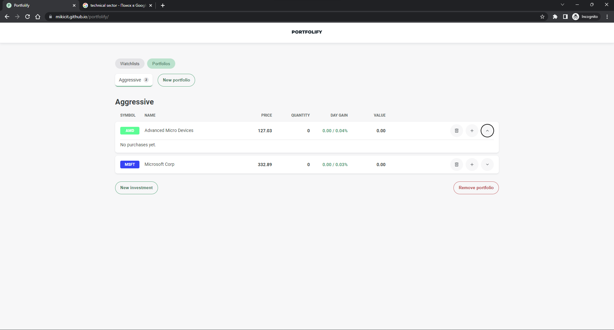
*Description: Portfolio View (Adding investments as in watchlists)*

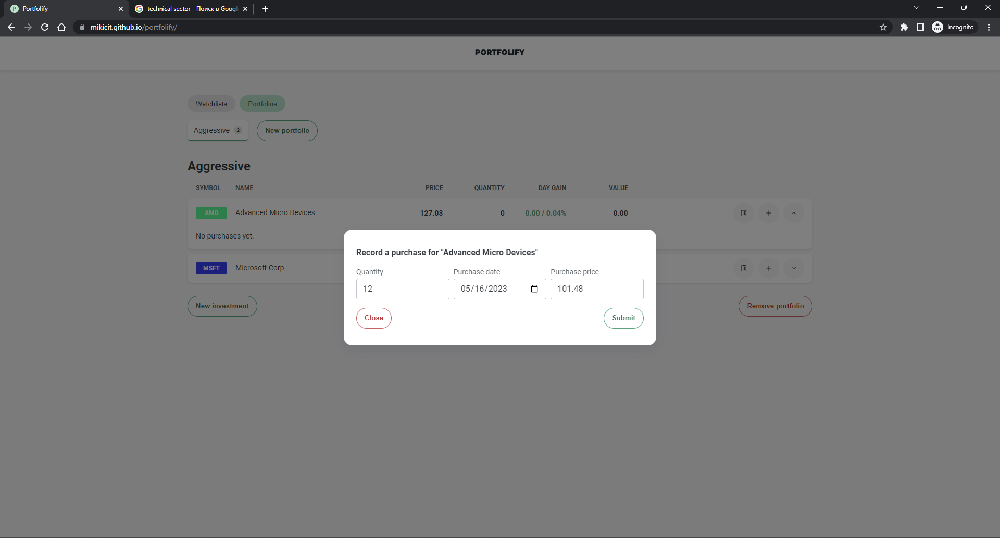
*Description: Add new purchase (When you select a date, the price is pulled up automatically)*

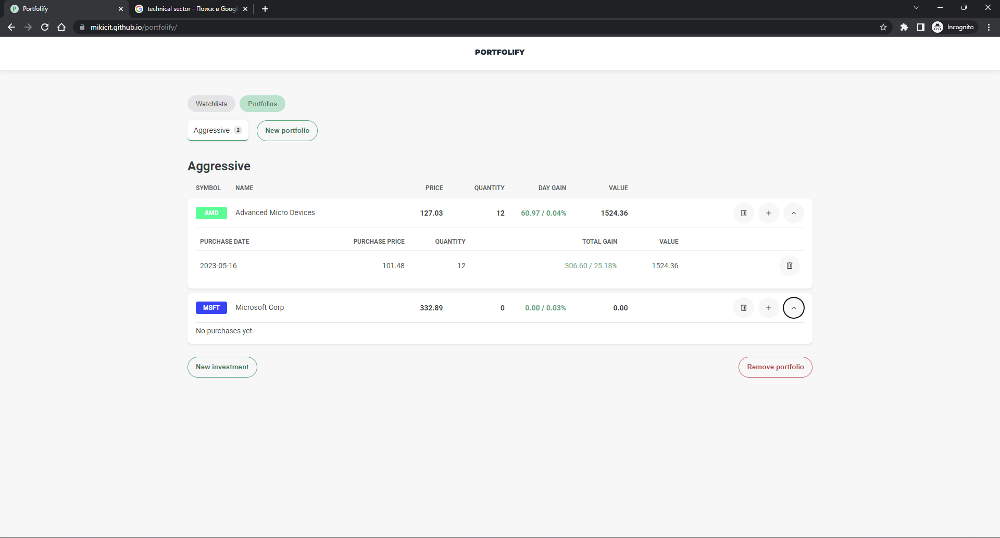
*Description: Show new purchase*

